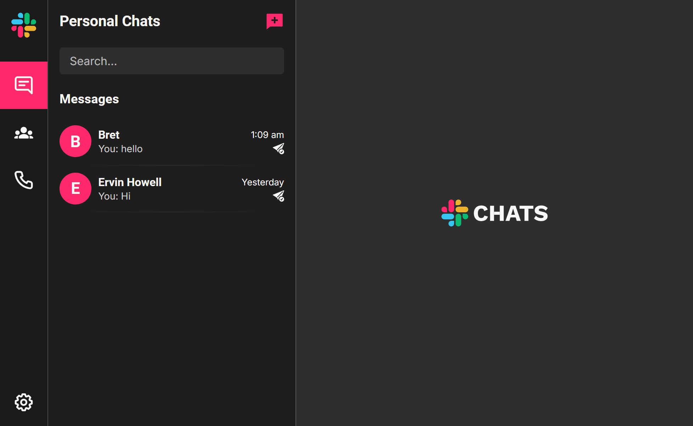

# Chatting WebApp 📱💬

A **personal project** to showcase my skills in designing and building modern web applications. This real-time chatting platform provides an engaging user experience with secure login, intuitive messaging, and personalization options.

---

## 🚀 Features

### 🔒 Authentication

- **User Registration**: Register new accounts with email.
- **Email Verification**: Verify accounts via OTP.
- **Single Device Login**: Enforces logout from other devices upon new login.

### 💬 Messaging

- **Text & Image Messaging**: Send both text and images in chats.
- **Read Receipts**: See when your messages are read.
- **Online Status**: Check the online presence of users.
- **Chat with Registered Users**: Start conversations with registered users.

### 👥 Groups

- Create and manage group chats seamlessly.
- **Add Users to Groups**: Include registered users in your groups for group chats.

### 🎨 Themes

- **Light/Dark Mode**: Switch between light and dark themes.
- **Color Options**: Choose from 4 color themes to personalize the app.

### 🌐 Progressive Web App (PWA)

- Uses **IndexedDB** for offline data storage, ensuring functionality without an
  internet connection.
- Implements a **Service Worker** to handle background tasks and cache assets for
  offline use.
- Caches key resources for improved performance and availability, even when offline.

---

## 🛠️ Tech Stack

- **Frontend**: React.js, Vite, SCSS
- **Backend**: Node.js, Express.js, Webpack
- **Database**: MongoDB
- **Real-Time Communication**: WebSocket
- **Hosting**:
  - **Frontend**: Hosted on [Netlify](https://www.netlify.com/)
  - **Backend**: Hosted on [Render](https://render.com/)

---

## 📸 Screenshots

---
